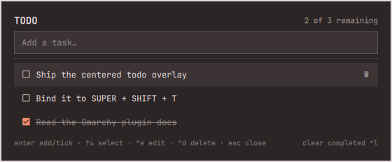

# Todo

A centered, keyboard-driven todo overlay for [Omarchy](https://omarchy.org/).

One keybinding opens a card in the middle of the focused monitor with the
input already focused, so the same key both captures a task and reviews the
list. Escape puts it away.



## Why an overlay and not a bar widget

Bar widgets drop their panel under the bar, in a corner. This plugin is a
layer-shell `overlay` instead, so it opens centered on whichever monitor
Hyprland currently has focused — a quick capture surface rather than
something you go to the corner of the screen to find.

## Install

```bash
omarchy plugin add https://github.com/sttwister/omarchy-todo.git --enable --yes
```

Then bind a key in `~/.config/hypr/bindings.lua`:

```lua
o.bind("SUPER + SHIFT + T", "Todos", "omarchy-shell shell toggle sttwister.todo")
```

## Keys

| Key | Action |
|-----|--------|
| type + `Enter` | add the task |
| `Enter` (empty input) | tick the selected task off |
| `↑` / `↓` | move the selection |
| `Ctrl+E` | rename the selected task in the input |
| `Ctrl+D` | delete the selected task |
| `Ctrl+L` | clear completed tasks |
| `Esc` | cancel a rename → clear the input → close |

Mouse works too: click a row to tick it, right-click to rename, and the
trash icon on the selected or hovered row deletes it.

Completed tasks sink to the bottom and open tasks float to the top, with
order preserved inside each group.

## Storage

Tasks live in a plain JSON file, so they are easy to read, sync, or edit
by hand:

```
~/.local/state/omarchy/settings/sttwister.todo.json
```

```json
[
  { "title": "Check out pstack", "completed": false }
]
```

The file is watched, so an external edit shows up in the overlay without a
restart. A corrupt file degrades to an empty list rather than blocking the
panel from opening.

## Theming

The overlay borrows the `[menu]` tokens from the active Omarchy theme, so it
matches the Omarchy menu, clipboard, and emoji pickers automatically — no
per-plugin color configuration.

## Development

The plugin directory *is* the checkout; edit in place and Omarchy hot-reloads
saved QML.

```bash
node --test tests/                          # pure logic in Todos.js
omarchy plugin validate .                   # manifest against the schema
omarchy-shell shell rescanPlugins           # force a reload
omarchy-shell shell toggle sttwister.todo   # open it
```

| File | Role |
|------|------|
| `manifest.json` | plugin id, kind (`overlay`), entry point |
| `Overlay.qml` | the panel: surface, monitor routing, keys, list |
| `Todos.js` | parsing, sorting, serializing — no QML types, so `node` can test it |

## License

MIT
